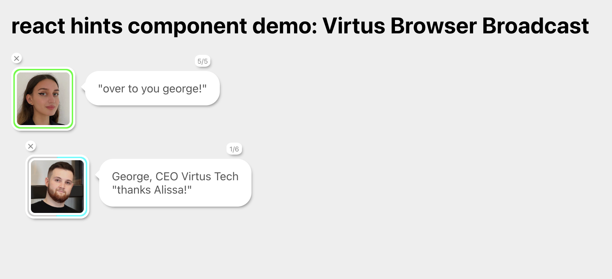

# react-hints-component

demo
https://react-hints-component-demo.netlify.app/

## features
- no dependencies on other libraries (other than react itself)
- clear and expansive API to personalise your hints
- localisation (support for multiple languages)

## roadmap 
- release version 1 on to Node Package Manager (NPM) for widespread usage
- storybook examples of usage of API
- develop more features and updates without breaking prior versions (remain compatible with older versions)

## TODO:
- make text unselectable inside speech-bubble
- make sure default css styles can be overridden (so people can style it to match their app guidlines/themes)
- make component use a container via a targetContainer element prop, if not supplied defaults to window/document.body?
- click ones to end text scroll, click again to skip timeout delay before next text
- error handling msgs for users of library
- add a ref to component
- fix non auto-mode
